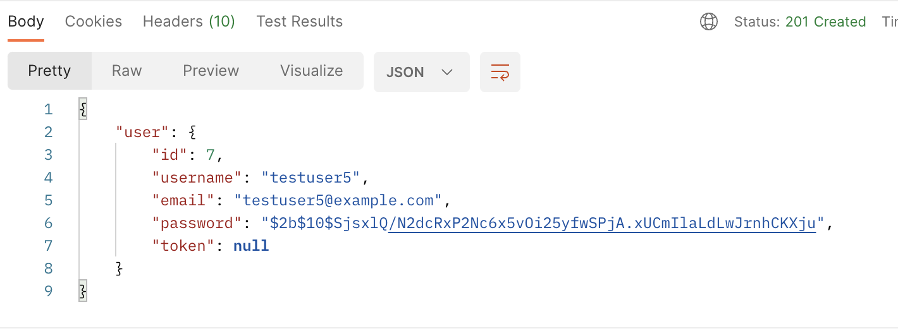
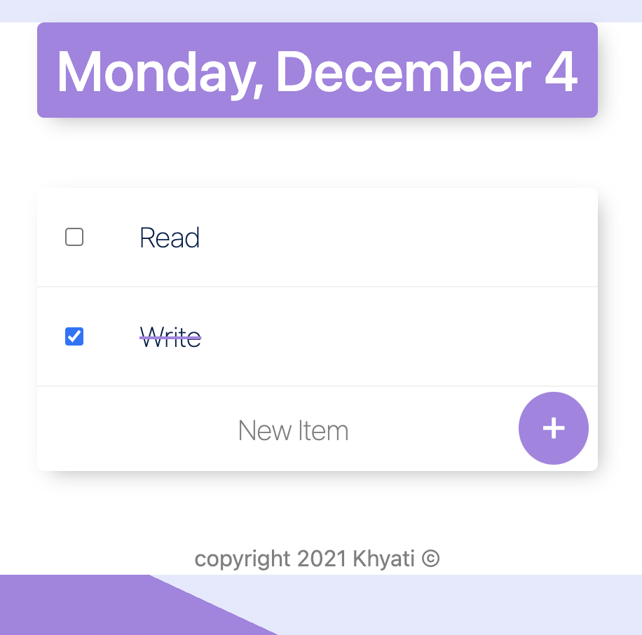

# Fullstack Personal To-Do List

You can manage your daily tasks and cross off the completed tasks easily to boost productivity.

This project is a Node.js and Express.js application that implements user registration, authentication, and rate-limiting functionalities. It uses EJS for templating, PostgreSQL for data storage, and bcrypt for password hashing.

## Technology Stack   

- Node.js 
- Express js
- PostgreSQL
- bcrypt
- express-rate-limit

## Salient Features
- User Registration (Sign Up):
API endpoint for user registration.
Collect and validate user information (username, email, password).
Hash and securely store passwords in the PostgreSQL database.
Implement validation to ensure unique usernames and emails.

- User Authentication (Login):
API endpoint for user authentication (login).
Verify user credentials against the stored information in the database.
Generate and return a secure authentication token upon successful login.
Use industry-standard practices for token generation and validation.
Secure API Endpoint with Rate Limiting:

- Create a secure API endpoint that requires authentication.
Implement rate limiting on this endpoint to prevent abuse and enhance security.
Choose a reasonable rate limit (e.g., 5 requests per minute) and document the rate-limiting strategy.

## Project Structure

The project is structured as follows:

- **`app.js`:** Main entry point of the application.
- **`views/`:** Directory for EJS templates.
- **`public/`:** Directory for static assets (CSS, images).
- **`database/`:** Directory for database-related files (schema.sql, migrations, etc.).

## Rate-Limitations

```javascript
const limiter = rateLimit({
  windowMs: 60 * 1000, // 1 minute
  max: 5, // 5 requests per minute
});
```
This creates a rate-limiting middleware using the express-rate-limit package. The configuration specifies that a client is allowed a maximum of 5 requests per minute (max: 5) within a rolling window of 1 minute (windowMs: 60 * 1000).


## Demo 





## Installation

Follow these steps to set up and run the Currency Converter project on your local machine:

1. Clone the repository to your local machine:
```bash
git clone https://github.com/khyatigupta369/Datiffy---BE.git
```

2. Set up the PostgreSQL database:
```bash
CREATE TABLE users (
    id SERIAL PRIMARY KEY,
    username VARCHAR(255) UNIQUE NOT NULL,
    email VARCHAR(255) UNIQUE NOT NULL,
    password VARCHAR(255) NOT NULL
);
```

Run the SQL schema from database/schema.sql to set up the user table.

3. Install all required packages for the backend:
```bash
npm install
```

4. Start the development server:
```bash
nodemon app.js
```

## Support and Contact

For any questions, feedback, or support related to the Currency Converter App, please don't hesitate to reach out:

- [Khyati Gupta]
- Email: [khyatigupta369@gmail.com]
- GitHub: [GitHub Profile](https://github.com/khyatigupta369)
